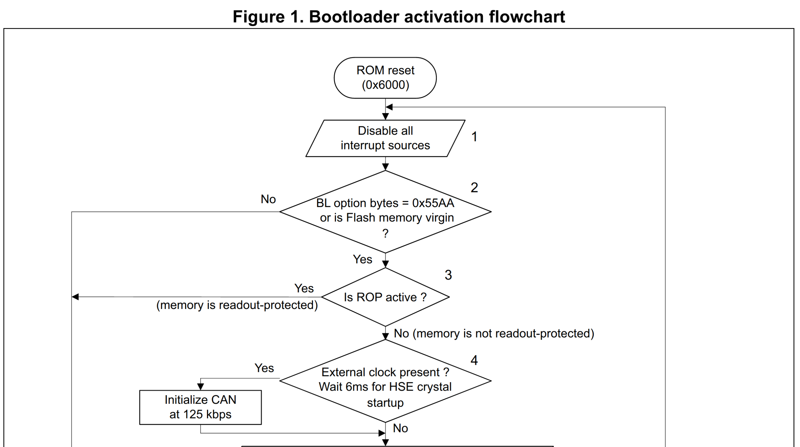

STM8 microcontrollers are capable, inexepensive, well-documented microcontrollers useful in many scenarios. They have a readout protection(ROP) feature that stops attackers from reading out or partially writing data to the device. Readout protection can prevent attacks such as: 
 * Reading sensitive data saved on the device
 * Creating duplicate devices by copying the firmware
 * Writing a trojan horse into an unused section of memory and executing it

However, this built in readout protection can be subverted with a technique called Voltage Glitching.

Let's take a deep dive into the STM8 bootloader, swim interface, dissassembly, voltage glitching and more to learn how to crack STM8 Read Protection.

# How Does Read Protection Work?

Here is the memory layout of an STM8:

The option bytes section contains 11 bytes of data to configure various aspects of device operation. The first byte is called the Readout Protection(ROP) Byte. If the first byte is `0xAA`, then Read Protection is enabled.

When the STM8 first boots up, the reset vector is at 0x60000 and from here execution starts. This is where the bootloader is stored in ROM. The bootloader is a piece of code responsible for detecting when a programmer is trying to load an application program onto the STM8.

Here is a the first section of the Activation flowchart of the bootloader.

The part of interest to us is step 3, "Is ROP active?". Here the Read Protection byte from the option byes is checked. If we could skip this check, then the bootloader would continue on to step 4, even if Read Protection is enabled.

Let's take a look at the exact assembly being executed at this point. The bootloader 

# Voltage Glitching

Voltage glitching aims to cause a microcontroller to malfunction in some way by precisely adjusting the power supplied to it. In this case, I am aiming to cut power to the STM8 for a very short amount of time to cause the it to skip the single instruction in the bootloader responsible for checking the read protection byte.

contain a collection of data called option bits, stored in flash memory on the device that dictate general behaviour of the device.
One such bit is the Read Protect bit, which disables reading out the flash memory. If an stm8 has the Read Protect bit set and you try to read out the flash memory of the device, it will return all zeros.

Interestingly, if you try to read out more memory than the device even has, it will simply keep providing zeros for the requested length.
You can however write to the device still. However if you try to unset the read protect bit with the intention of then performing a read of the flash, it will also return all zeros, because unsetting the read protect bit also necessarily overwrites the flash with zeros permanantly.

The Strategy:
To get around the read protect bit, one strategy is to try and 'skip' the instruction that performs the check. This is accomplished by precisely and temporarily cutting power to the cpu when it executes the compare and jump instruction to check the option bit(find the exact instruction in the STM8 rom, or recreate my own and look at the disassembly, show a screen print). The program counter will increment like normal and continue execution beyond the compare and jump instruction without jumping.
To accomplish this, we need to try a whole bunch of different intervals where the instruction might occur, and a number of different lengths of time to cut power to the cpu for. Looping through all the options
To accomplish this, we need to repeatedly read the flash memmory on the stm8. Each time we read memory, we cut power to the cpu at a different time or for a different length of time. Eventually after enough attempts, the firmware should be successfully read.

The Setup:
First of all, I wrote a python script to repeatedly read the first byte of flash memory from the stm8. The first assumption I make is that the first byte of flash in non-zero[Is this reasonable? What does the first byte of flash represent?]. If the byte is 0, then we assume memory access was blocked and try again. If the byte isn't 0, then we assume we successfully skipped the read protection bit, and perform one more read to read the entire flash memory of the device

Next, I programmed a second microcontroller to perform the logic of cutting power to the stm8. I call this the fault-injection uc. The second assumption I make is that the time between the falling edge of the reset line of the programmer and the option bit compare instruction executing is always the same(more or less). If this is true, then I can synchronize my fault-injection uc to begin a timer on the falling edge of the reset line, then generate a pulse of a specific length to cut power.

To consider what sort of timing requirements are necessary here, I looked at how long an instruction execution takes on the stm8. Given an internal clock of 16MHz(62.5ns period), and typically 3 clock cycles per instruction, this yields an instruction time of 187.5ns
[insert screenshot of the cpu programming guide page 23. Make sure I'm understanding it correctly: https://www.st.com/resource/en/programming_manual/cd00161709-stm8-cpu-programming-manual-stmicroelectronics.pdf]
    Need to find exactly what instructions need to be run, and how long the compare instruction takes in clock cycles

These timings are possible with the ESP32's RMT module, which can generate pulses with multiples of 12.5ns(1/80MHz) accuracy

Now that I've decided on the fault-injection microcontroller, I programmed it to react to the falling edge of the reset line and generate a pulse of varied pulse width and varied initial delay, to cut power to the stm8.

Now that the microcontroller is generating pulses of the proper length to cut power to the stm8, how can I actually cut power to the STM8?

Fortunately the stm8 exposes a Vcap pin which is the voltage supply of the internal cpu. This means I don't need to account for(or remove) capacitance on the 5V power supply line, and allows more fine-tuned control of the voltage on the cpu itself
[research the Vcap pin and see if what I'm saying is correct. Why is it exposed? I should answer that here]

I cannot simply connect my microcontroller's output to the Vcap pin though, instead I need to use the microcontroller's output to short Vcap to ground with a MOSFET. I used the following simple MOSFET circuit.
[show schematic S1, handdrawn or otherwise]

The esp32 is crashing! When I trigger a single stm8 program sequence, which has two falling edges on the reset line as shown above, is triggering my esp32 gpio interrupt 64 times! I don't know entirely what is going on here, but to mitigate it, I added a timeout where if the interrupt occurs within 30ms of a previous interrupt, it's ignored. This is essentially debouncing logic, and I don't know what it's necessary, but it worked a charm.
[Show capture of the reset line and code showing an interrupt of the gpio pin from the esp32 to see when the first falling edge of reset is found]
    Try using a hardware pulldown rather than the internal pulldown

With the system fully setup I began the sequence and took some captures of the Vcap to see how clean my cutouts to ground are. At 125ns pulse width it does nothing more than vibrate Vcap.

NOTE: Since the esp32 gpio pin sees the mosfet as a giant capacitor, this circuit is very hard on the esp32 and I wouldn't build a product with this circuitry, but for this purpose it works well enough.

Rational for intial delay timing and pulse width timing values:
    I programmed an stm8 with a firmware that pulls a gpio pin high, and analyzed the output along with the reset pin on an osilliscope.
    [show oscilliscope output]
    This shows that the stm8 begins executing user instructions after __us, so I shouldn't need to delay for longer than that
    In terms of initial timing delays, here's an oscilliscope capture of Vcap on start up alongside the reset pin
    [show oscilliscope output]
    This seems to indicate that the cpu doesn't begin performing any instructions at all until _us has passed, since instruction execution is met with slight variation in Vcap

The Execution:
With the system fully in place, it's time to begin the attack.

[ show results, what timings I needed to perform the attack]
How reproducible is it? Does it work every time?
How much can I vary the parameters and still have it work? Plot this
