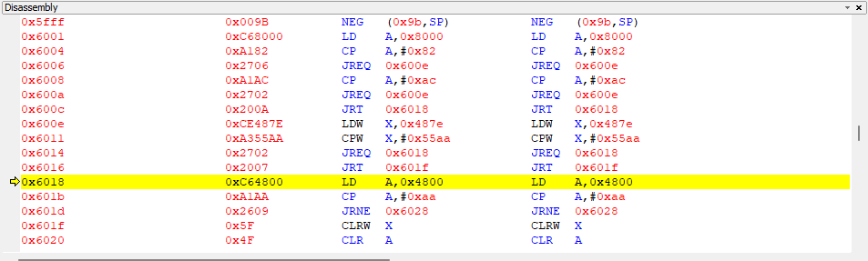
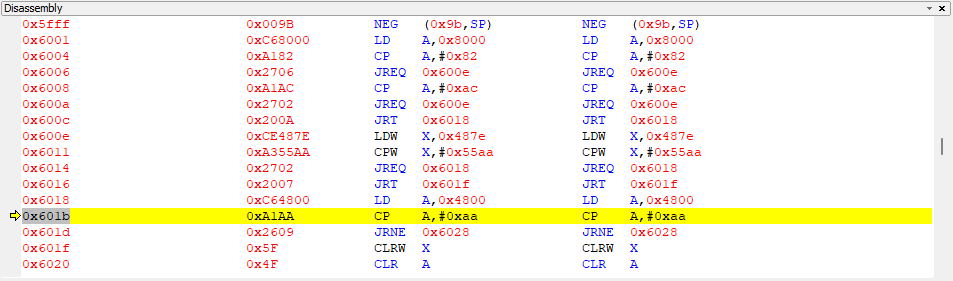
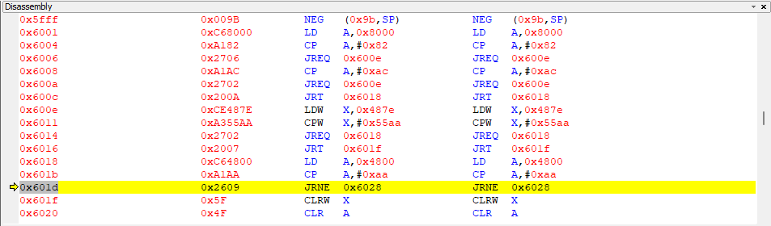
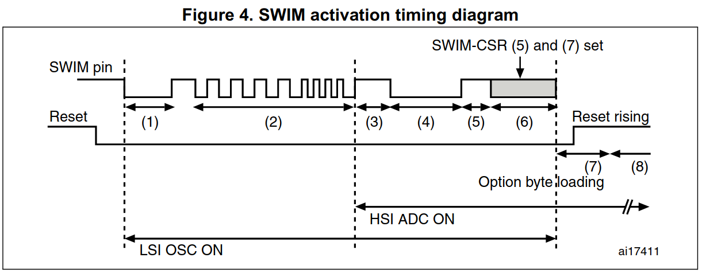

Microcontroller used: stm8105k4

STM8 microcontrollers are capable, inexepensive, well-documented microcontrollers useful in many scenarios. They have a readout protection(ROP) feature that stops attackers from reading out or partially writing data to the device. Readout protection can prevent attacks such as: 
 * Reading sensitive data saved on the device
 * Creating duplicate devices by copying the firmware
 * Writing a trojan horse into memory and executing it

However, this built in readout protection can be subverted with a technique called Voltage Glitching.

Let's take a deep dive into the STM8 bootloader, swim interface, dissassembly, voltage glitching and more to learn how to crack STM8 Read Protection.

# How Does Read Protection Work?

Here is the memory layout of an STM8:

[2]

The option bytes section contains 11 bytes of data to configure various aspects of device operation. The first byte is called the Readout Protection(ROP) Byte. If this byte is `0xAA`, then Readout Protection is enabled.

When the STM8 first boots up, the reset vector is at `0x60000` and from here execution starts. This is where the bootloader is stored in ROM. The bootloader is a piece of code responsible for detecting when a programmer is trying to load an application program onto the STM8.

Here is a the first section of the Activation flowchart of the bootloader.

[1]

The part of interest to us is step 3, "Is ROP active?". Here the Readout Protection byte from the option bytes is checked. If we could skip this check, then the bootloader would continue on to step 4, even if Readout Protection is enabled.

Here's a disassembly of the exact assembly being executed at this point. Descriptions of the instructions are available from the STM8 Programming Manual[3].
The first instruction is an `LD` instruction.

This loads the value at address `0x4800` into CPU register A.
Consulting the memory layout from above tells us that `0x4800` corresponds to the option bytes. The first byte of which is the ROP byte.

Next we compare the value of register A to `#0xAA`. The `#` tells us this is an immediate addressing mode so it's comparing to the exact value `0xAA`. Remember a value of `0xAA` in the ROP byte enables Readout Protection. [2]

Bits in the Condition Code register are set based on the result of the comparision. If register A equals `0xAA`, then the Z bit is set. If it doesn't equal `0xAA`, then the Z bit is cleared.

Finally the CPU performs a `JRNE` instruction, or a **Conditional Jump Relative Instruction**. The `NE` here means Not Equal. The CPU will jump to the address `0x6028` if the Z bit of the Condition Code register is 0.

For reference, When the Z bit is set to 1, this indicates the result of the last operation is zero.

Putting it all together:
1. The ROP byte is loaded into Register A
2. It is compared to `0xAA` to see if ROP is enabled or not
3. If ROP is not enabled, then it jumps to `0x6028` and continues bootloader execution. Otherwise it continues to the next line and exits the bootloader.

Our goal is to jump to 0x6028 and continue bootloader execution, even if the ROP Byte is `0xAA`.

## Side Note, ICP vs Bootloader Programming
There are two methods of externally programming the STM8. One is the bootloader, what we have analyzed here and have access to the dissasembly for analysis. Second is ICP, In-circuit Programming with the SWIM(Single Wire Interface Module). This programming method relies on an external peripheral to perform programming, reading and debugging operations independent of the CPU[4]. The studied disassembly from the bootloader code above isn't actully the instruction we are skipping, since I'll be programming through the SWIM. However the SWIM still fetches the ROP byte from the same location in memory and if I can skip or corrupt that load sequence, the ROP byte check will be skipped just the same.
Here is the SWIM activation timing diagram showing the initial startup sequence of the SWIM. 

Take note of step (7), Option byte loading. Here the ROP byte is loaded into memory and checked. This is as close as I can get to analyzing how the SWIM interacts with and checks the ROP byte.

## Theoretical Instruction Skipping
Suppose we could skip the execution of a single instruction. Could we manage to jump to 0x6028 and continue bootloader execution even when the ROP byte is 0xAA? 

### Skipping the JNE Instruction
This won't do it. We need to jump to `0x6028`. Skipping the jump takes us into the section that exits the bootloader. 

### Skipping the Comparision Instruction
This doesn't work either because the zero flag is already set from a previous instruction. 

### Skipping the Load Instruction
However if we skip the LD instruction that loads the ROP byte into register A, then we will be comparing the previous value of register A to `0xAA`, not the ROP byte. It just so happens that register A contains `0x82` from a previous computation so this will work!

In summary, it's theoretically possible to bypass the ROP byte check and run the bootloader by skipping the single LD instruction that loads the ROP byte into Register A.

Now the question is, how can we achieve this? Allow me to introduce fault injection attacks.

# Skipping Instructions with Fault Injection

Fault injection attacking is a very broad category, however there are two main approaches on an embedded device to trigger a skipped/corrupted instruction. **Clock glitching** and **voltage glitching**.

## Clock Glitching

Each instruction execution takes a certain amount of time to execute. Every clock cycle a new instruction is executed. If the edge of the next clock cycle arrives before an instruction can complete, then this instruction doesn't fully execute. We can use this to our advantage by triggering a new clock edge precisely following the previous one. The instruction that was being executed that clock cycle doesn't complete and the next instruction immediately begins. In this way, clock glitching can precisely and (sometimes) repeatably skip an instruction by counting the number of clock cycles and inserting a glitched clock cycle to skip/corrupt the desired instruction. 

This attack is best used when the clock source is an external oscillator. However our device uses an internal osciallator to generate the clock, so this approach isn't feasible.

## Voltage Glitching

The second main approach is voltage glitching. This involves precisely cutting power to the CPU for a brief moment, stopping the execution of an instruction or otherwise corrupting the results. This is achieved by shunting Vcc of the cpu to ground temporarily. Voltage glitching is the approach we will use to bypass the ROP byte check.

Downsides of a voltage glitch are that unlike glitching the clock where nothing is stopping you from controlling the clock yourself, there are many forces trying to keep Vcc where it's at. These include the voltage regulator supplying the voltage, and various capacitors added to maintain and smooth that voltage. While I may be able to remove some of these capacitances, I will first try to perform the glitch without modifying the hardware if possible.

# Execution

The STM8 exposes a Vcap pin at 1.8V that is connected to the internal regulator for the CPU[2]. This is good for us trying to cut power to just the CPU. I will use a transistor to pull Vcap to ground temporarily.

## Speed Requirements of Glitching Hardware
The STM8's clock runs at 16MHz. If I want to cut power for a single clock cycle, this's a 62.5ns period. Using the RMT module on the ESP32 I can produce pulse widths of multiples of 12.5ns(1/80MHz). This should be sufficient to perform a voltage glitch on the STM8.

## Glitching Hardware Circuit
The circuit will be as follows:

[circuit diagram]
esp32 connected to gate of transistor
source of transistor connected to ground
drain of transistor connected to Vcap
Ground of esp32 connected to ground of STM8

## Attack Plan
My computer will repeatedly attempt to read the first byte of flash data from the STM8 through an ST-Link STM8 Programmer. This programmer device will communicate with the SWIM on the STM8 to perform the read. If the ROP byte check succeeds, then the STM8 will simply return `0` for every byte I attempt to read. However if the ROP byte check fails, then `0x82` will be returned, the first byte in flash memory of a programmed STM8. My script checks if the single byte read is `0` or not. If it's not, it will perform one final read of the entire flash memory, then stop.

The flash reading operation is initiated by first holding the CPU in reset, then releasing the reset pin and communicating with the STM8. My assumption is the time between the falling edge of the reset pin and the ROP byte check will be almost exactly the same every attempt. If this is true, then I can wait for some amount of time after the falling edge of the reset pin(**initial delay**), then pull Vcap to ground for some other amount of time(**glitch width**). If both these times are correct, then the ROP byte check should be skipped.

## Determine Reasonable Bounds for Initial Delay and Glitch Width
### Initial Delay
**Upper Bound**
A reasonable upper bound for the initial delay is how long it takes from the falling edge of a reset pin to the first instruction execution on regular boot. 
TODO: Perform time-to-first-instruction check with ossciliscope and custom code on the STM8

**Lower Bound**
I can't reason a lower bound much above 0.

### Glitch Width
**Lower Bound**
Write a simple program that solely increments two counters repeatedly. I can test various glitch widths and see how long I need to glitch to reliably cause a missed increment. 

**Upper Bound**
See how far I can push the glitch width until the STM8 starts crashing consistently.

Running these tests I determined the following bounds:

            Initial Delay   Glitch Width
Lower Bound ____            ____
Upper Bound ____            ____

### Performing the Attack

# Citations
[1] STM8 bootloader, UM0560 User Manual, Rev 10, STMicroelectronics, 2017
[2] STM8S105K4 Datasheet, DocID14771, Rev 15, STMicroelectronics, 2015
[3] STM8 CPU Programming Manual, PM0044 Programming manual, Doc ID 13590 Rev 3, STMicroelectronics, 2011

Clock glitching: https://chipwhisperer.readthedocs.io/en/latest/tutorials/courses_fault101_soln_fault%201_1%20-openadc-cwlitearm.html#tutorial-courses-fault101-soln-fault-1-1-openadc-cwlitearm
Voltage glitching: https://chipwhisperer.readthedocs.io/en/latest/tutorials/courses_fault101_soln_fault%202_1%20-openadc-cwlitearm.html#tutorial-courses-fault101-soln-fault-2-1-openadc-cwlitearm
